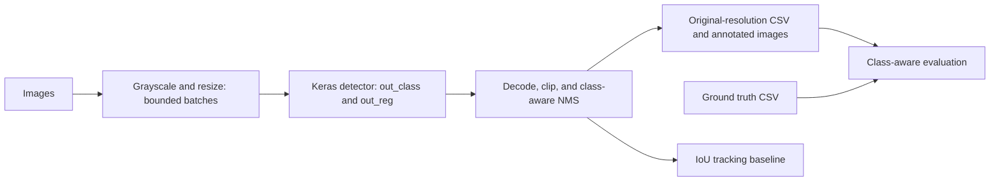

# Architecture

The maintained package separates numerical operations, file formats, model
construction, and command execution. Evaluation requires only NumPy; OpenCV
and TensorFlow load only for commands that use them.

## Model

`models.build_detector` adapts the inception architecture in the original
`helper_model1.construct_model_anchorless_detector_skip_v1`. Three convolution
and pooling blocks reduce the spatial dimensions by eight. Parallel 1x1, 3x3,
and 5x5 branches feed a softmax classification head and a four-channel linear
regression head. The original layer order and head names are retained. Weight
compatibility with particular historical checkpoints still needs verification.

## Postprocessing

`detection.decode_predictions` accepts one image's output tensors. The grid
centers begin at half the stride. The supported regression conventions are:

- `position_size`: row/column offsets and image-relative height/width.
- `distances`: top/left/bottom/right distances from the grid center.

Each channel has an explicit scale coefficient. Decoding keeps the highest
probability class per grid cell, removes background and invalid boxes, clips
to image boundaries, and suppresses same-class overlaps by confidence.
It never modifies the supplied prediction tensors.

The archived clustering code averaged overlapping windows and discarded
probability scores. Confidence-ranked NMS intentionally changes that behavior;
evaluate it on a held-out research dataset before comparing published results.

## Evaluation And Tracking

Evaluation processes detections in descending confidence order and matches each
to its best unmatched same-class ground truth above the IoU threshold. Each
ground truth can contribute at most one true positive. Per-class results use
the same assignments as the overall result.

The tracker greedily assigns the highest same-class IoU pairs, at most once
per track and detection. Tracks expire after configurable missed frames. It
is a baseline, not the archived Siamese model: occlusion and rapid movement can
change IDs. It does not estimate vehicle speed. Speed estimation requires a
validated camera calibration and accurate frame timing.

## Efficiency

IoU and decoding use NumPy arrays instead of per-pixel Python loops. NMS remains
quadratic in the worst case, but computes overlaps vectorially without storing
the complete pairwise matrix. Inference loads a model once and uses float32
batches. Video processing reads one frame at a time. No numerical speedup or
throughput claim is made without a measured benchmark.
